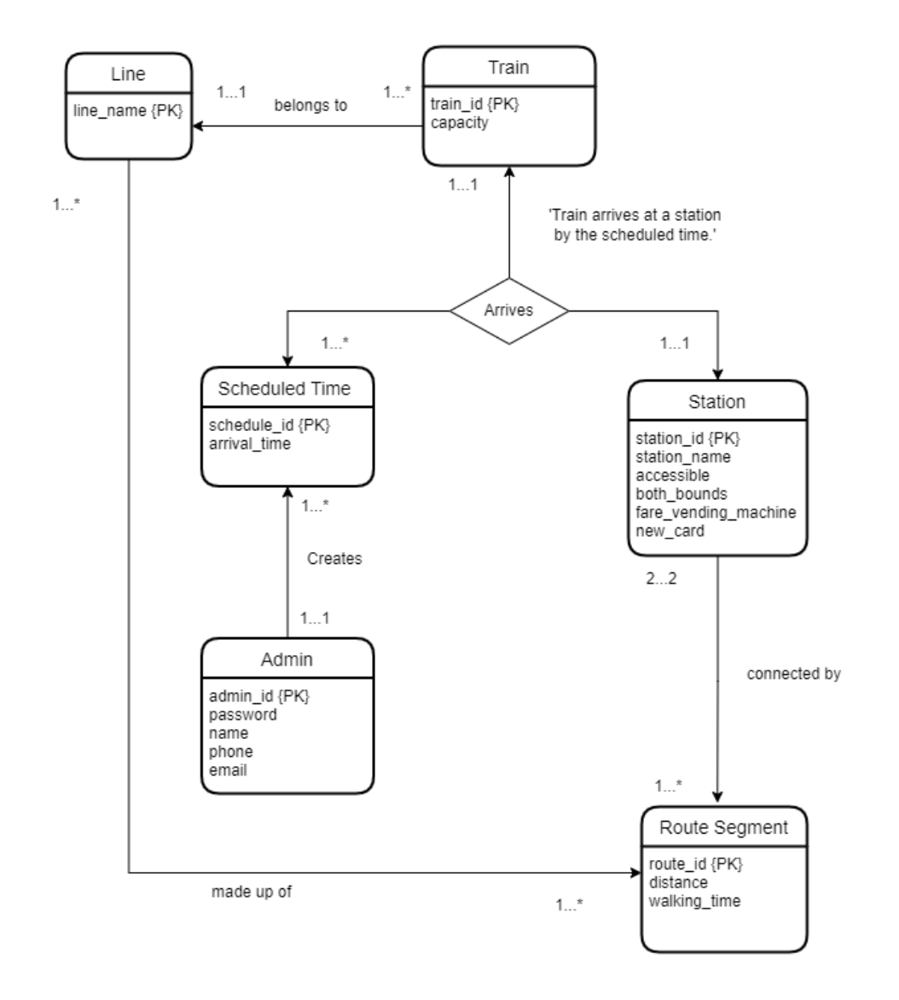
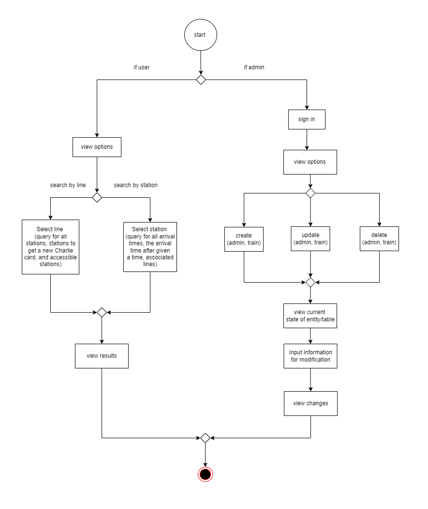

# MBTA CRUD App

## CS5200 Database Management System Project

This project was created for the CS5200 Database Management System course's final project. This simple 
database and application allows users to make numerous useful queries regarding the MBTA (Massachusetts Bay Transportation Authority) subway stations, trains, and lines. The database reflects the concepts learned throughout the semester in this class, including how to create a database (tables, queries, functions, and procedures) while the application allows users to perform CRUD operations (create, read, update, and delete).

## Project Overview 
The MBTA CRUD App was created using SQL and MySQL for the database, PyMySql to connect the 
database with the front end (the Terminal) and Python for the front end code. Through this application, 
users are able to search by station or line and retrieve information. For a station, users could get
information such as all arrival times, the arrival times after a given time, and the associated lines 
of a station. For the line, users are able to get information such as all the stations in that line or 
some of that stations in that line such as ones where riders can get a new Charlie card or ones that are 
accessible.

## Database Design (UML diagram)
The following is the conceptual design of this database. This database has 6 entities: Line, Train, Schedule Time, Station, Admin, and Route Segment. A Line represents the different lines in the MBTA such as Red, Orange, Green(B,C,D,E), and Blue. A Train represents a specific train that belongs to a line and that will arrive at a station at a specific scheduled time. An Admin represents someone who can perform CRUD operations to create and manipulate the entities or instances of entities in this database, such as creating a scheduled time instance. Finally, a route segment is an entity that represents a part of a route that connects one station to it's next consecutive station. For example, path on the tracks between Symphony station and Northeastern University station on the Green E line is a route segment. This entity helps represent the order of the stations within each line. 


## Technical Specification
- MySQL workbench (for the database)
- Python and the terminal (for the front end client application)

## Prerequites 
- python or [python3](https://www.python.org/downloads/)
    
    to verify python installation: 
    ```bash
    python -V
    ```
    or 
    ```bash
    python3 -V
    ```
- [pip](https://pip.pypa.io/en/stable/installation/) or pip3
    
    to verify pip installation: 
    ```bash
    pip -V
    ```
    or 
    ```bash
    pip3 -V
    ```
- [PyMySQL](https://pypi.org/project/pymysql/)
    
    to verify PyMySQL installation run the following command and find PyMySQL in the list: 
    ```bash
    pip list
    ```
    or 
    ```bash
    pip3 list
    ```
- MySQL ([server](https://dev.mysql.com/downloads/mysql/) and [workbench](https://dev.mysql.com/downloads/workbench/))

## Installation
1. Clone the repository
2. Open MySQL workbench and connect to your MySQL database then import dump file using the "import "mbta_db_dump.sql" command. (This action will create the database 'mbtadb' along with all the necessary tables, data, functions and procedures.)

## How to Use
1. Open the terminal and navigate to the directory of the cloned repository.
2. Run "python mbta_db_app_code.py" or "python3 mbta_db_app_code.py"
3. Enter your MySQL workbench credentials 

## Activity Diagram (user flow of the system) 
After you enter your MySQL workbench credntials. You will be prompt for your role (either user or admin). The user will only be allowed to perform READ operations while the admin is allowed to perform CREATE, UPDATE, and DELETE operations as shown in the activity diagram below. After each operation, the you will be prompt to perform another operation or to quit the application. Some demo accounts for the admin role are: 
1. admin_id: 1 || password: boston1
2. admin_id: 2 || password: mbta2
3. admin_id: 3 || password: trains3




