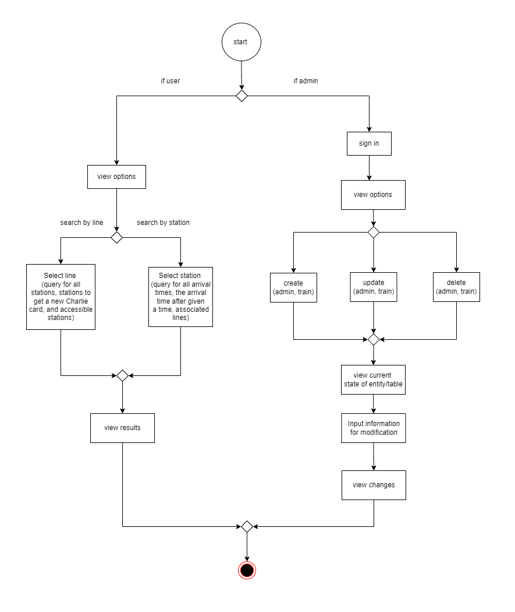

# MBTA Database Querier

## CS5200 DataBase Management System Project

This project was created for the CS5200 Database Management System course's final project. This simple 
database and application allows users to make numerous useful queries regarding the MBTA
(Massachusetts Bay Transportation Authority) subway stations, trains, and lines.

## Project Overview 
The MBTA Database Querier was created using SQL and MySQL for the database, PyMySql to connect the 
database with the front end (the Terminal) and Python for the front end code. Through this application, 
users are able to search by station or line and retrieve information. For a station, users could get
information such as all arrival times, the arrival times after a given time, and the associated lines 
of a station. For the line, users are able to get information such as all the stations in that line or 
some of that stations in that line such as ones where riders can get a new Charlie card or ones that are 
accessible.

## Technical Specification
- MySQL workbench (for the database)
- Python and the terminal (for the front end client application) 

## How to Use 
1. Clone the repository
2. Open MySQL workbench and connect to your MySQL database then import "LiklikadceNYuS_dump.sql" 
3. Open the terminal and navigate to the director of the cloned repository.
4. Run "python LiklikadceNYuS_app_code.py" or "python3 LiklikadceNYuS_app_code.py"
5. Enter your MySQL workbench credentials 

## Activity Diagram (user flow of the system) 

